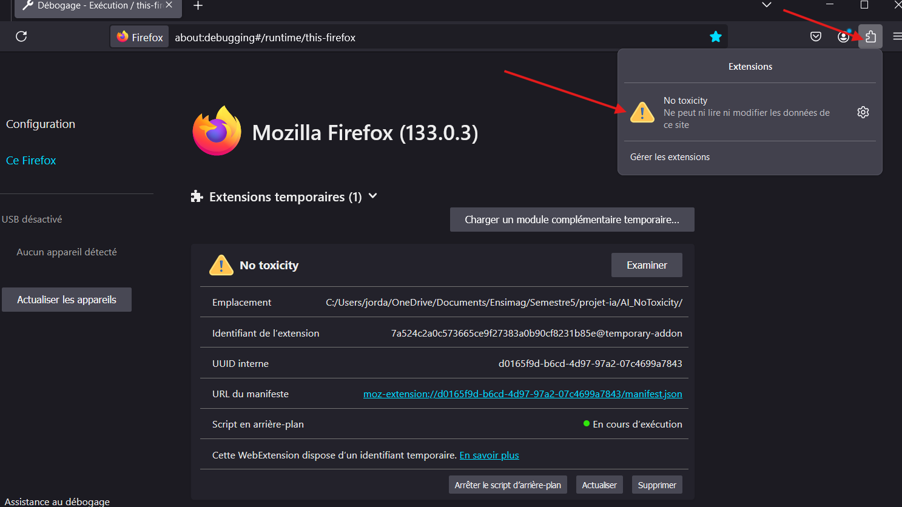
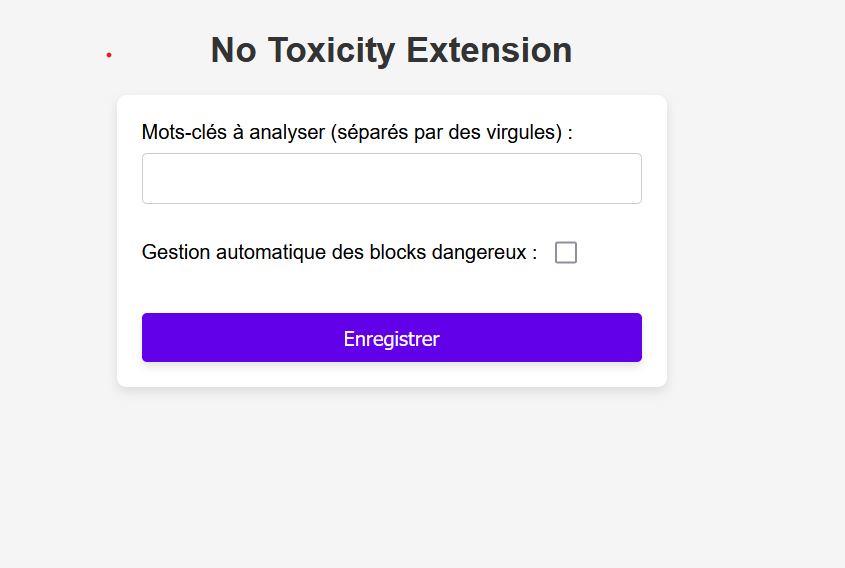

# No Toxicity Extension

## Prérequis

Assurez-vous d'avoir `npm` installé sur votre machine.

## Installation

### Compilation

1. **Installer les dépendances :**

   ```sh
   npm install
   ```

2. **Build la solution :**
    ####  Chrome:
        npm run build:chrome
        
    #### Firefox:
        npm run build:firefox

Après avoir généré la solution, vous pouvez charger l'extension dans votre navigateur et commencer à l'utiliser pour analyser les textes toxiques.

### Importation

#### Chrome:
1. Ouvrez chrome://extensions/ dans votre navigateur Chrome.
2. Activez le mode développeur en haut à droite.
3. Cliquez sur "Charger l'extension non empaquetée" et sélectionnez le dossier contenant votre extension.

#### Firefox:

1. Ouvrez about:debugging#/runtime/this-firefox dans votre navigateur Firefox.
2. Cliquez sur "Charger Add-on Temporaire" et sélectionnez le dossier contenant votre extension.

## Utilisation

Une fois l'extension installé dans votre navigateur, vous devriez la voir dans vos extensions :



Si vous cliquez sur l'extension, vous aurez une fenêtre pour les options de l'extension. Vous pouvez cliquer sur le bouton "Options", puis aller sur la page de configuration de l'extension :



Le champ avec les mots-clés sont utilsés par le model `Universal Sentence Encoder (USE)` de Tensorflow et la case à cocher permet d'activer le model que nous avons créé avec nos propres données. Plus d'informations à ce sujet sont présents directement dans le rapport.